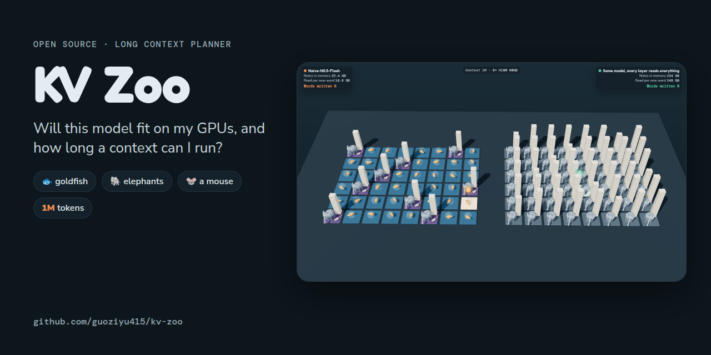
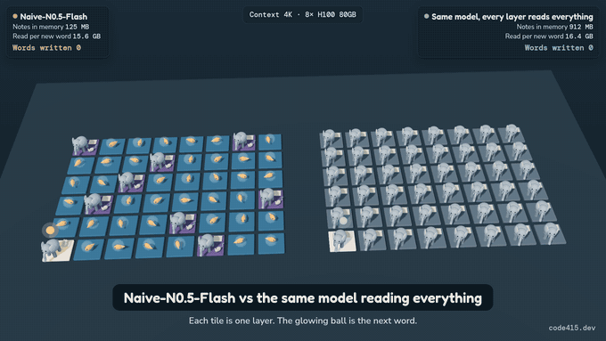
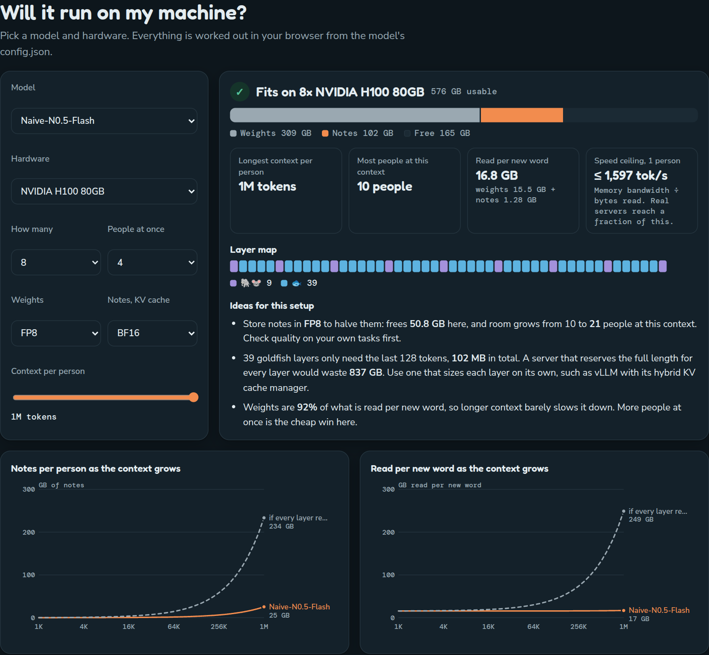

<p align="center">
  
</p>

<p align="center">
  <b>Will this model fit on my GPUs? How long a context can I run? How fast?</b><br>
  KV Zoo reads a model's <code>config.json</code> and answers, layer by layer. It also turns every kind of attention into an animal, so the answer makes sense to people who are not ML engineers.
</p>

<p align="center">
  <a href="https://code415.dev/demos/2026-09-28/kv-zoo"></a>
  
  
  <a href="LICENSE"></a>
</p>

<p align="center">
  <a href="https://code415.dev/demos/2026-09-28/kv-zoo"><b>Live demo</b></a> ·
  <a href="#quick-start"><b>Quick start</b></a> ·
  <a href="#meet-the-zoo"><b>The zoo</b></a> ·
  <a href="#how-it-works"><b>How it works</b></a>
</p>

<br>

<p align="center">
  
</p>

<p align="center"><sub>Left: Naive-N0.5-Flash. Right: the same model with every layer reading everything. Each tile is one layer, the stacks are the notes it keeps, and the glowing ball is the next word. At 1M tokens the left park keeps 25 GB of notes, the right one 234 GB.</sub></p>

## Why

A language model writes one token at a time. For every new token, each layer looks back at the notes it keeps about earlier tokens, the KV cache. With full attention those notes grow with the context and all of them are reread for every new token, which is why long context is expensive.

[Naive-N0.5-Flash](https://huggingface.co/NaiveAI/Naive-N0.5-Flash) reads up to 1,048,576 tokens with no full attention layer at all:

- **39 goldfish layers** use a sliding window and only keep the last 128 tokens, 25.6 MB in total at any length.
- **9 elephant layers** use DeepSeek sparse attention. They keep every note, but a small indexer, the mouse, picks the 2,048 worth reading.

At 1M tokens that is **25.4 GB** of notes instead of **234 GB**, and **16.8 GB** read per new token instead of **249 GB**, for the same weights. KV Zoo does this arithmetic for any model and any hardware, then tells you what to change.

## Quick start

```bash
curl -O https://raw.githubusercontent.com/guoziyu415/kv-zoo/main/kv_zoo.py
python3 kv_zoo.py naive --gpu h100 --count 8 --ctx 1m
```

```
--------------------------------------------------------------
KV ZOO  Naive-N0.5-Flash
48 layers: 9 elephant + mouse (sparse attention, DSA, top 2048); 39 goldfish (sliding window, window 128)
Setup: 8 x NVIDIA H100 80GB, weights FP8, notes BF16, 1 person, context 1M
--------------------------------------------------------------
Fits                         yes, 576 GB usable
  weights                    309 GB
  notes, KV cache            25.4 GB
  free                       242 GB
Longest context per person   1M
Most people at this context  10
Read per new token           16.8 GB  (weights 15.5 GB + notes 1.28 GB)
Speed ceiling, 1 person      <= 1,597 tok/s  (bandwidth / bytes read; real servers reach a fraction)
--------------------------------------------------------------
context    notes/person   read/token     if all read all  read/token
4K         125 MB         15.6 GB        912 MB           16.4 GB
32K        818 MB         15.6 GB        7.30 GB          22.8 GB
128K       3.20 GB        15.7 GB        29.2 GB          44.7 GB
256K       6.37 GB        15.9 GB        58.4 GB          73.9 GB
1M         25.4 GB        16.8 GB        234 GB           249 GB
--------------------------------------------------------------
Ideas
  * Store notes in FP8 to halve them: frees 12.7 GB here, and room grows from 10 to 21 people at this context.
  * 39 goldfish layers only need the last 128 tokens, 25.6 MB in total. A server that reserves the full length
    for every layer would waste 209 GB. Use one that sizes each layer on its own, such as vLLM with its hybrid
    KV cache manager.
  * Weights are 92% of what is read per new token, so longer context barely slows it down.
```

Any Hugging Face repo or local file works too:

```bash
python3 kv_zoo.py Qwen/Qwen3-Next-80B-A3B-Instruct --total 80 --active 3 --gpu m3ultra --count 1 --ctx 256k
python3 kv_zoo.py ./config.json --total 70 --active 70 --gpu h200 --count 2 --users 8 --kv fp8
python3 kv_zoo.py gptoss --gpu rtx5090 --count 2 --ctx 128k --compare qwen32
```

| Option | What it does |
|---|---|
| `model` | A preset (`naive`, `deepseek`, `gptoss`, `qnext`, `qwen32`), a Hugging Face repo `org/name`, or a path to `config.json` |
| `--gpu` | `h100`, `h200`, `b200`, `a100`, `rtx5090`, `rtx4090`, `m3ultra`, `spark` |
| `--count` | How many of them |
| `--ctx` | Context per person, like `32k` or `1m` |
| `--users` | People served at once |
| `--weights`, `--kv` | Formats: `bf16`, `fp8`, `int4` for weights; `bf16`, `fp8` for the KV cache |
| `--total`, `--active` | Parameters in billions, for models that are not presets. The config does not say |
| `--compare` | A second model to put in the table |
| `--json` | Machine readable output |

The [live page](https://code415.dev/demos/2026-09-28/kv-zoo) has the same planner with charts, and you can paste any `config.json` into it. Nothing leaves your browser.

<p align="center"></p>

## Meet the zoo

| Animal | Attention | Keeps notes for | Reads per new token | Used by |
|---|---|---|---|---|
| 🐘 Elephant | Full attention | every token | every token | Qwen3-32B, most classic models |
| 🐟 Goldfish | Sliding window | the last W tokens | the last W tokens | Naive-N0.5-Flash, gpt-oss |
| 🐘 + 🐭 Elephant with a mouse | Sparse attention, DSA | every token, plus a tiny FP8 index | the index, then the top k tokens | Naive-N0.5-Flash |
| 🐿️ Squirrel | MLA | every token, packed into 576 numbers | every packet | DeepSeek, Kimi |
| 🐿️ + 🐭 Squirrel with a mouse | MLA + DSA | every packet, plus the index | the index, then the top k packets | DeepSeek-V3.2 |
| 🐫 Camel | Linear attention | one fixed size state | the state | Qwen3-Next |

## How it works

For each layer, from the config:

- **Full attention:** `bytes per token = kv_heads × (key_dim + value_dim) × bytes per number`, kept for all `L` tokens and read in full.
- **Sliding window:** the same per token, but only `min(L, window)` tokens are kept and read.
- **DSA:** every token is kept, plus an index key of `index_head_dim` numbers in FP8. Reading is the whole index plus `min(L, top_k)` full notes.
- **MLA:** `kv_lora_rank + qk_rope_head_dim` numbers per token.
- **Linear attention:** a fixed state of `value_heads × key_dim × value_dim` plus the short convolution, stored in BF16.

Then for your hardware:

- **Fits** if `weights + notes × people ≤ 90% of memory`. Weights are `parameters × bytes per weight`.
- **Longest context** and **most people** solve that inequality the other way.
- **Speed ceiling** is `memory bandwidth ÷ bytes read per new token`, where bytes read are the active weights plus the notes each layer reads. Writing a token at small batch sizes is limited by memory bandwidth, so this is an upper bound. It assumes perfect scaling across GPUs and ignores compute and communication, so real servers reach a fraction of it.
- **If every layer read everything** is the same model with sliding windows turned into full attention, DSA turned off and linear layers replaced by the model's own full attention shape. It is a what if for comparison, not a real model.

Layer patterns come from `layer_types`, `hybrid_layer_pattern`, `full_attention_interval` or `sliding_window_pattern`. Multimodal configs are read from `text_config`.

## Presets

| Model | Layers | Max context | Parameters |
|---|---|---|---|
| [Naive-N0.5-Flash](https://huggingface.co/NaiveAI/Naive-N0.5-Flash) | 39 goldfish, 9 elephant + mouse | 1M | 309B total, 15.5B active |
| [DeepSeek-V3.2](https://huggingface.co/deepseek-ai/DeepSeek-V3.2) | 61 squirrel + mouse | 160K | 671B total, 37B active |
| [gpt-oss-120b](https://huggingface.co/openai/gpt-oss-120b) | 18 goldfish, 18 elephant | 128K | 117B total, 5.1B active |
| [Qwen3-Next-80B-A3B](https://huggingface.co/Qwen/Qwen3-Next-80B-A3B-Instruct) | 36 camel, 12 elephant | 256K | 80B total, 3B active |
| [Qwen3-32B](https://huggingface.co/Qwen/Qwen3-32B) | 64 elephant | 40K | 32.8B |

`configs/` holds the fields copied from each repo's `config.json` on September 28, 2026.

## Limits

- Estimates, not measurements. Servers add their own overhead, block sizes and buffers.
- Quality at long context is not measured. A sparse or windowed model can miss things a full attention model would find.
- Sliding window layers are counted at exactly the window; some servers keep a little more.
- Hardware numbers: H100 80GB 3.35 TB/s, H200 141GB 4.8 TB/s, B200 180GB 7.7 TB/s, A100 80GB 2.0 TB/s, RTX 5090 32GB 1.79 TB/s, RTX 4090 24GB 1.0 TB/s, M3 Ultra 512GB 819 GB/s, DGX Spark 128GB 273 GB/s.

## Files

```
kv_zoo.py          the planner, standard library only
docs/index.html    the 3D page, also works on GitHub Pages
configs/           config fields for the presets
```

## Credits

- 3D: [three.js](https://threejs.org), MIT license. Animals are original low poly models built in code.
- Made by [@Code415zg](https://x.com/Code415zg) for [Code415 Radar](https://code415.dev), a daily digest of what people are paying attention to in AI, LLMs and CS.

[MIT license](LICENSE).
